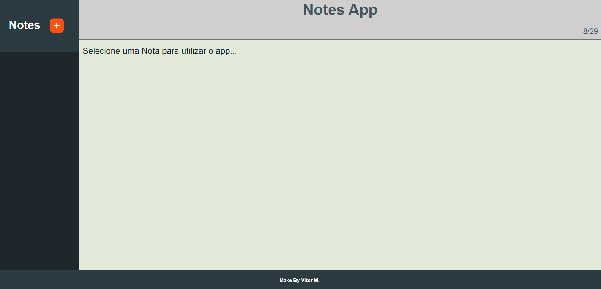
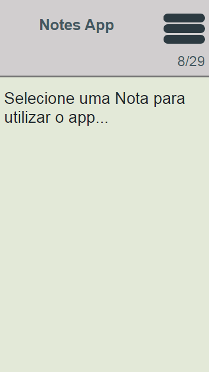
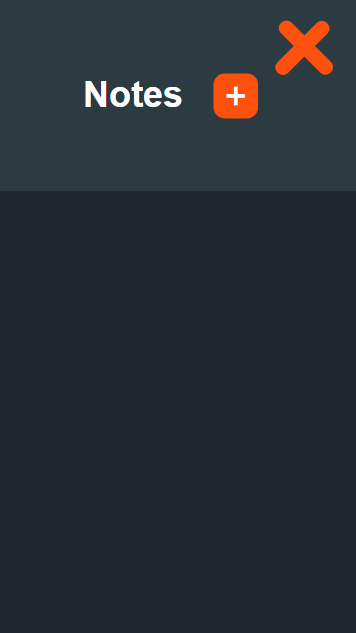

# Note app

Aplicação web de bloco de notas.

 

## SUMÁRIO

- Status
- Deploy
- Features
- Demonstração da Aplicação
- Como Rodar a Aplicação
- Pré Requisitos Para Rodar a Aplicação
- Tecnologias utilizadas
- Autor

## Status

✨Concluído ✨

## Deploy

- [https://vitor-mat.github.io/Note-App---React/](https://vitor-mat.github.io/Note-App---React/)

## Features

- Você pode criar notas independentes
- Site responsivo
- As notas são salvas no localStorage
- Você pode também editar e excluir as notas do storage

## Demonstração da Aplicação

### Note App Desktop

### Note App Mobile 1

### Note App Mobile 2

## Pré Requisitos Para Rodar a Aplicação

- Instalar o Node Js.

## Como Rodar a Aplicação

Pelo promt de comando entre na pasta do projeto, em seguida rode o comando npm install (para instalar as dependências), e por fim, rode o comando npm start (para que o projeto seja iniciado no navegador).

## Tecnologias Utilizadas

- [React_Js](https://pt-br.reactjs.org/docs/getting-started.html)
- [Sass](https://sass-lang.com/documentation)

## Autor

Feito por Vitor Mateus

 
